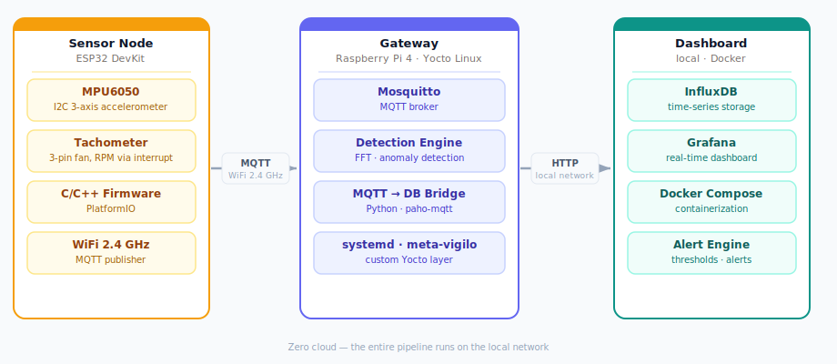
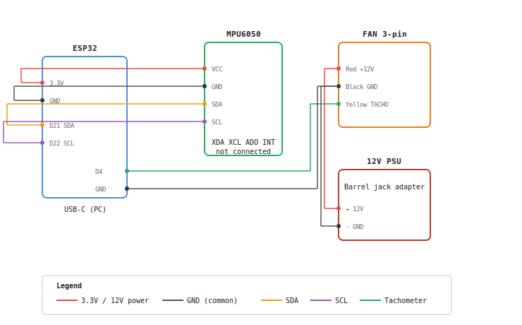

# Vigilo

> Edge predictive maintenance, zero cloud.

[](LICENSE)
[]()
[]()

Vigilo is an open source **edge AI predictive maintenance platform** for rotating machines - motors, pumps, fans, compressors, actuators. The entire pipeline runs on the local network: from data acquisition to anomaly detection, from historical dashboards to alert generation. No cloud, no subscription, no data leaving the site.

## Architecture

<p align="center">
  
</p>

| Component | Device | Role |
|---|---|---|
| **Sensor Node** | ESP32 + MPU6050 | Vibration acquisition (I2C) and RPM (interrupt), MQTT publishing |
| **Gateway** | Raspberry Pi 4 · Yocto Linux | MQTT broker, anomaly detection, bridge → InfluxDB, alerts |
| **Dashboard** | Grafana + InfluxDB (Docker) | Real-time and historical visualization, alert panel |

## Tech stack

| Layer | Technology |
|---|---|
| Firmware | C/C++, PlatformIO |
| Protocol | MQTT (PubSubClient / Mosquitto) |
| Gateway OS | Yocto Linux (Poky + meta-raspberrypi + meta-vigilo) |
| Data bridge | Python, paho-mqtt |
| Storage | InfluxDB |
| Dashboard | Grafana |
| Containerization | Docker Compose |
| ML (phase 5) | TensorFlow Lite Micro |

## Hardware

| Component | Specs |
|---|---|
| Microcontroller | ESP32 DevKit v1 |
| Accelerometer | MPU6050 (I2C) |
| Test bench | 3-pin PC fan (tachometer on pin 3) |
| Tachometer pull-up | 10 kΩ resistor to 3.3V |
| Gateway | Raspberry Pi 4 (2 GB+), 5.1V/3A USB-C PSU |
| Gateway storage | MicroSD 16-32 GB, class A1/A2 |

> The test bench is a PC fan with a simulated mechanical imbalance. Vigilo is designed for any rotating machine with a sensor mounting point.

## Wiring



## Repository structure

```
vigilo/
  firmware/      # ESP32 code (PlatformIO, C/C++)
  dashboard/     # Docker Compose + Python MQTT→InfluxDB bridge
  ml/            # training scripts, exported models
  docs/          # architecture, theory, devlog
```

The custom Yocto layer for the gateway lives in a separate repository: [meta-vigilo](https://github.com/vannidelprete/meta-vigilo).

## Development

### Firmware

Requirements: PlatformIO CLI or VS Code PlatformIO extension.

Before building, create `firmware/include/secrets.h` (see `firmware/include/README.md`).

Run unit tests (no hardware required):

```bash
cd firmware
pio test -e native
```

Build and flash to device:

```bash
pio run -e esp32dev --target upload
```

Open serial monitor:

```bash
pio device monitor
```

Before building, copy firmware/include/README.md instructions to create your local firmware/include/secrets.h.

### Dashboard

Requirements: [Docker Desktop](https://www.docker.com/products/docker-desktop/) (or Docker Engine + Compose plugin on Linux) and [mkcert](https://github.com/FiloSottile/mkcert) for local HTTPS certificates.

Copy `dashboard/.env.example` to `dashboard/.env` and fill in your own credentials.

Generate a local TLS certificate (one-time; replace the IP with your machine's LAN address):

```bash
mkcert -install
cd dashboard
mkdir certs
mkcert -cert-file certs/cert.pem -key-file certs/key.pem localhost 127.0.0.1 192.168.1.13
```

Start InfluxDB, Grafana, and the MQTT bridge:

```bash
cd dashboard
docker compose up -d
```

InfluxDB: https://localhost:8086
Grafana: https://localhost:3000

Stop the containers (data persists in dashboard/influxdb-storage/ and dashboard/grafana-storage/):

```bash
docker compose down
```

### Running CI locally

Requires [Docker Desktop](https://www.docker.com/products/docker-desktop/) and [act](https://nektosact.com/):

```bash
# login if required
docker login

# firmware build check
act push --workflows .github/workflows/firmware.yml

# dashboard lint
act push --workflows .github/workflows/dashboard.yml

# ML lint + tests
act push --workflows .github/workflows/ml.yml
```

## License

[MIT](LICENSE)
